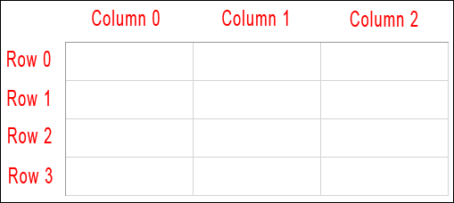

# Usage of Tkinter

Uso do tkinter em python3 para construir interfaces gráficas.

## Criar widgets básicos na interface
Importar o tkinter
```python  
from tkinter import *
```  

Criar uma janela
```python  
window = Tk()
```
Criar widgets

```python


# Button
button_examplo = Button(window, text="Execute")

# Entry (Input)
input_examplo = Entry(window)

# Criar um text widget (output)
output_examplo = Text(window, height=1, width=20)

# Criar um label
label = Label(window, text="Tkinter!")
```

## Meter os widgets na interface


```python

button_examplo.grid(row=0, column=0)


input_examplo.grid(row=0, column=1)


output_examplo.grid(row=0, column=2)
```

## Passar uma função num botão
Exemplo de mostrar na consola "Confirmado!" ao clicar no botão


```python
def mostrar_confirm():
    print("Confirmado!")


botao = Button(window, text="Executar", command=mostrar_confirm)
```

## O input no output
Obter o valor da variavel usa-se o `.get()`
```python

def mostrar_confirm():
    print(input_value.get())


botao = Button(window, text="Executar", command=mostrar_confirm)

# Criar uma string var objetct
input_value = StringVar()

# Criar input
input = Entry(window, textvariable=input_value)

# Meter input
input.grid(row=0, column=1)
```